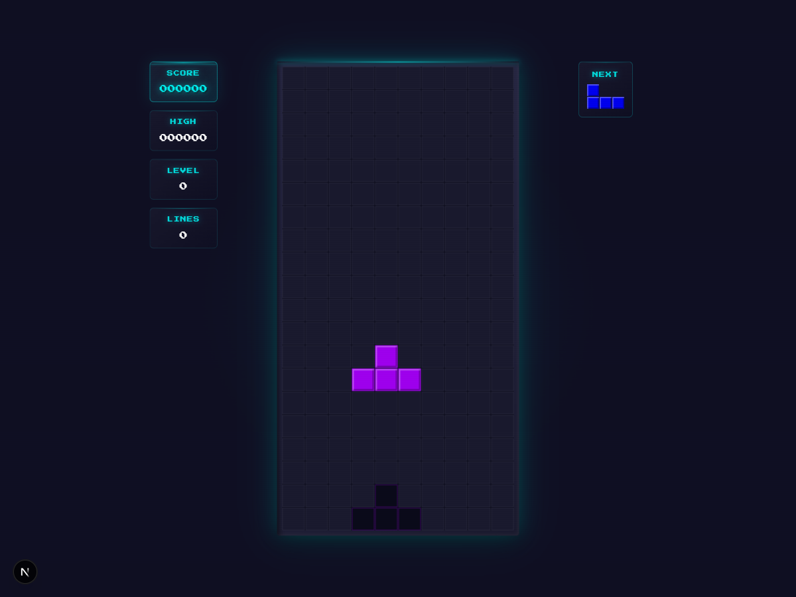
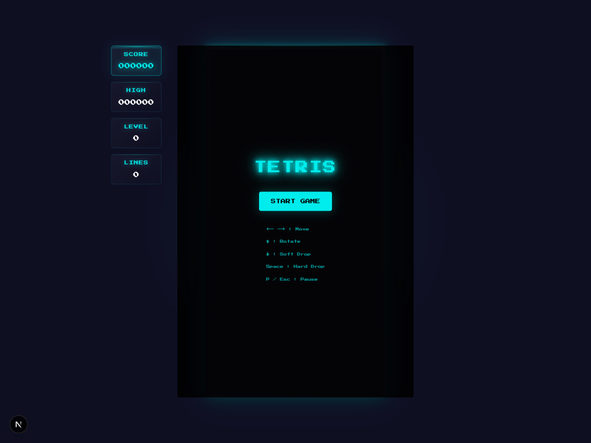

<div align="center">

# TETRIS

### A neon-soaked, arcade-inspired Tetris built with React & Next.js

<br />



<br />

**CRT scanlines. Glowing neon. The satisfying crunch of a Tetris clear.**

[Play Now](#getting-started) · [Features](#features) · [Controls](#controls)

</div>

---

## Features

- **Neon Arcade Aesthetic** -- CRT scanline overlay, pulsing ambient glow, starfield background, and glassmorphism UI panels that make you feel like you're in a midnight arcade
- **Classic Nintendo Scoring** -- Authentic point system: 40/100/300/1200 base scores for 1-4 line clears, multiplied by level
- **SRS Rotation System** -- Super Rotation System with full wall kick tables for both standard and I-piece tetrominoes
- **7-Bag Randomizer** -- Fair piece distribution using the standard 7-bag shuffle algorithm
- **Ghost Piece** -- See exactly where your piece will land
- **Hard Drop & Soft Drop** -- Space to slam, down arrow to slide
- **Line Clear Celebrations** -- Flash animations, score popups, and a dramatic "TETRIS!" callout for 4-line clears with screen shake
- **Progressive Difficulty** -- Speed increases every 10 lines cleared, minimum 100ms drop interval at high levels
- **Persistent High Scores** -- Your best run is saved to localStorage
- **Fully Responsive** -- Desktop layout with side panels, mobile layout with touch controls, landscape mode support
- **Touch Controls** -- D-pad movement + action buttons on mobile, plus swipe/tap gesture support on the board itself

## Screenshots

<div align="center">

| Start Screen | Gameplay |
|:---:|:---:|
|  |  |

</div>

## Tech Stack

| | |
|---|---|
| **Framework** | Next.js 16 (App Router, Turbopack) |
| **UI** | React 19, TypeScript |
| **Styling** | Tailwind CSS v4 + custom CSS animations |
| **Font** | Press Start 2P (via `next/font`) |
| **Icons** | Lucide React |

Zero external game libraries. Pure React state management with `useState` + `useCallback`. Custom hooks for keyboard input, touch gestures, and the game loop.

## Controls

### Keyboard

| Key | Action |
|-----|--------|
| `←` `→` | Move left / right |
| `↑` | Rotate clockwise |
| `↓` | Soft drop |
| `Space` | Hard drop |
| `P` / `Esc` | Pause |

### Mobile / Touch

| Input | Action |
|-------|--------|
| Tap | Rotate |
| Double tap | Hard drop |
| Swipe left / right | Move |
| Swipe down | Soft drop |
| Swipe up | Hard drop |

On-screen D-pad and action buttons are also available on mobile.

## Getting Started

```bash
# Clone the repo
git clone https://github.com/shokks/tetris.git
cd tetris

# Install dependencies
npm install

# Start the dev server
npm run dev
```

Open [http://localhost:3000](http://localhost:3000) and hit **START GAME**.

## Project Structure

```
app/
├── components/
│   ├── Game.tsx          # Main game orchestrator
│   ├── Board.tsx         # 10x20 grid renderer with ghost piece
│   ├── Controls.tsx      # Mobile touch controls
│   ├── ScorePanel.tsx    # Score / Level / Lines / High Score
│   ├── NextPiece.tsx     # Next piece preview
│   ├── GameOver.tsx      # Game over overlay
│   └── PauseMenu.tsx     # Pause overlay
├── hooks/
│   ├── useKeyboard.ts    # Keyboard input handling
│   ├── useTouch.ts       # Swipe & tap gesture detection
│   └── useGameLoop.ts    # requestAnimationFrame-based game loop
├── lib/
│   ├── gameLogic.ts      # Board state, collision, rotation, line clearing
│   ├── tetrominos.ts     # Piece definitions, SRS wall kick data
│   ├── scoring.ts        # Nintendo scoring formulas
│   └── storage.ts        # High score persistence
├── globals.css           # All styling, animations, responsive breakpoints
└── layout.tsx            # Root layout with Press Start 2P font
```

## License

MIT
